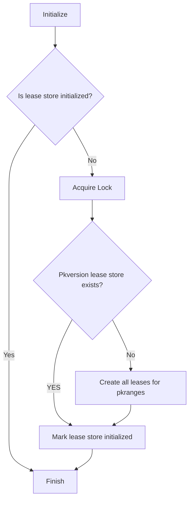
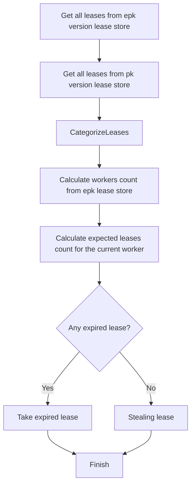

Another proposal change:
- Doing migration during load balanceing

- Customer opt-in
  - public ChangeFeedProcessorOptions setStartFromLeaseStore(CosmosAsyncContainer oldLeaseContainer, LeaseVersion)
