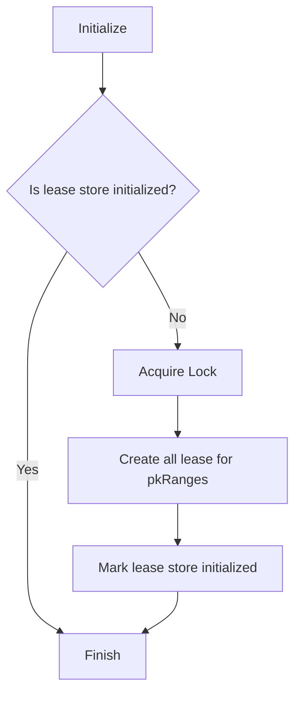
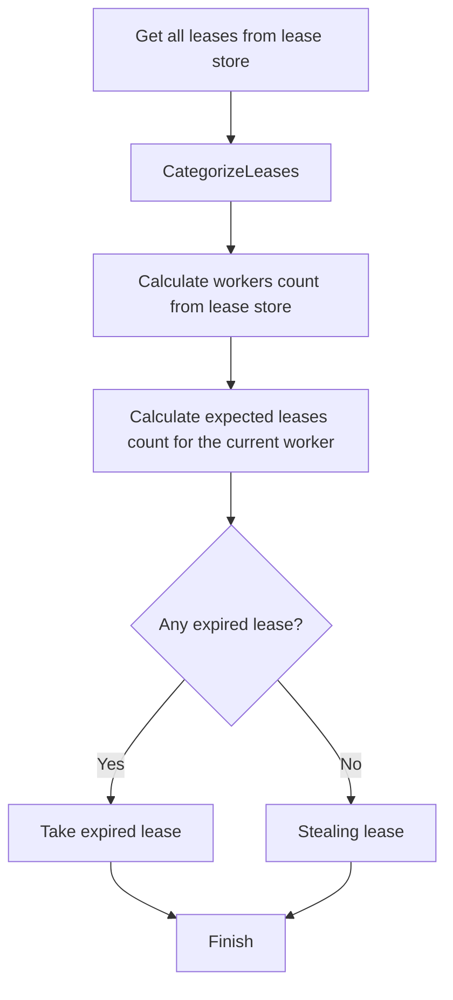
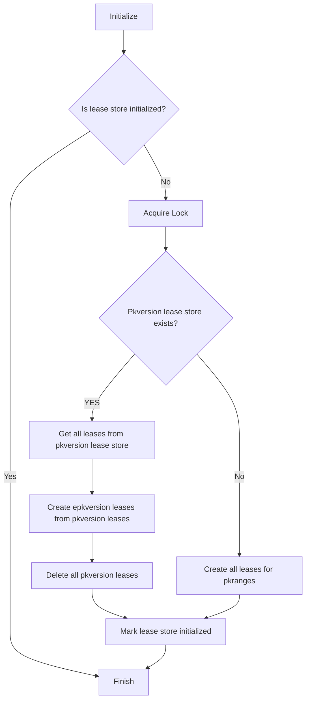

## Table of Contents
[Cosmos feed processor in Azure Cosmos DB](https://learn.microsoft.com/en-us/azure/cosmos-db/nosql/change-feed-processor?tabs=dotnet)

- [ChangeFeedProcessor internal implementation]()
- [Public API]()
- [Migration]()
- [Other Changes]()

## ChangeFeedProcessor internal implementation
Based on the lease version SDK use internally, we have `pkversion` and `epkversion`.
- pkversion lease container
  ```
  {
    "id":"TESTDatabaseAccount.documents.azure.com_RxJava.SDKTest.SharedDatabase_20221115T094259_AQi_e45790f7-e0cc-4697-8bc1-d8a95e792a9c.info"
  }
  ```
  ```
  {
    "id":"TESTDatabaseAccount.documents.azure.com_RxJava.SDKTest.SharedDatabase_20221115T094259_AQi_e45790f7-e0cc-4697-8bc1-d8a95e792a9c..0",
    "LeaseToken":"0",
    "ContinuationToken":"\"11\"",
    "timestamp":"2022-11-15T17:43:34.634427Z",
    "Owner":"ZKNjph"
  }
  ```

- epkversion lease container
  ```
  {
    "id":"TESTDatabaseAccount.documents.azure.com_bf8uAA==_bf8uALgoqxk=.info"
  }
  ```
  ```
  {
    "id":"TESTDatabaseAccount.documents.azure.com_RxJava.azure.com_bf8uAA==_bf8uALgoqxk=..-FF",
    "LeaseToken":"-FF",
    "ContinuationToken":"eyJWIjoxLCJSaWQiOiIvZGJzL1J4SmF2YS5TREtUZXN0LlNoYXJlZERhdGFiYXNlXzIwMjIxMTE1VDA5NTI1NV9LWFAvY29sbHMvOGM2NTNmNzUtOTc1OC00NmExLWJlMzItMjFjMDQwZDIzNDVhIiwiTW9kZSI6IklOQ1JFTUVOVEFMIiwiU3RhcnRGcm9tIjp7IlR5cGUiOiJCRUdJTk5JTkcifSwiQ29udGludWF0aW9uIjp7IlYiOjEsIlJpZCI6Ii9kYnMvUnhKYXZhLlNES1Rlc3QuU2hhcmVkRGF0YWJhc2VfMjAyMjExMTVUMDk1MjU1X0tYUC9jb2xscy84YzY1M2Y3NS05NzU4LTQ2YTEtYmUzMi0yMWMwNDBkMjM0NWEiLCJDb250aW51YXRpb24iOlt7InRva2VuIjoiXCIxMVwiIiwicmFuZ2UiOnsibWluIjoiIiwibWF4IjoiRkYifX1dLCJSYW5nZSI6eyJtaW4iOiIiLCJtYXgiOiJGRiIsImlzTWluSW5jbHVzaXZlIjp0cnVlLCJpc01heEluY2x1c2l2ZSI6ZmFsc2V9fX0=",
    "timestamp":"2022-11-15T17:43:34.634427Z",
    "Owner":"ZKNjph",
    "version":1,
    "feedRange":{
      "Range":{
        "min":"",
        "max":"FF",
        "isMinInclusive":true,
        "isMaxInclusive":false
      }
    }
  }
  ```
`"V":1,"Rid":"/dbs/RxJava.SDKTest.SharedDatabase_20221115T095255_KXP/colls/8c653f75-9758-46a1-be32-21c040d2345a","Mode":"INCREMENTAL","StartFrom":{"Type":"BEGINNING"},"Continuation":{"V":1,"Rid":"/dbs/RxJava.SDKTest.SharedDatabase_20221115T095255_KXP/colls/8c653f75-9758-46a1-be32-21c040d2345a","Continuation":[{"token":"\"11\"","range":{"min":"","max":"FF"}}],"Range":{"min":"","max":"FF","isMinInclusive":true,"isMaxInclusive":false}}}`

## Public API
- `handleChanges(Consumer<List<JsonNode>> consumer)` : targeted for `incremental` change feed mode, use `pkversion` changeFeedProcessor internally
- `handleAllVersionsAndDeletesChanges(Consumer<List<ChangeFeedProcessorItem>> consumer)` : targeted for `full fidelity` change feed mode, use `epkversion` changeFeedProcessor internally
- `handleLatestVersionChanges(Consumer<List<ChangeFeedProcessorItem>> consumer)`: targeted for `incremental` change feed mode, use `epkversion` changeFeedProcessor internally

## Migration
Unlike .Net SDK, Java SDK does not do implicit lease conversation, when customer onboarded to use the new API, it will targeting a new lease store, so the question need to ask here would be where SDK should start processing.
> Should SDK ignore the previous processed progress, and start from beginning?
  - Start from beginning 
    - Duplicate processing and unhappy customer (potential pick up a more recent time to reduce duplicate processing)
  - Resume from previous checkpoint
    - Minimal duplicate processing, and potential more complicated handling during migration and after migration

> Should we anonymous do the migration? Any reason why SDK should not do the automatic migration? 
(Note: Since there is only databaseId/collectionId being tracked in the lease store, so in case a collection being recreated, we could start from the wrong checkpoint)

> When migration happens, should SDK keep the old lease or delete the old lease
> If customer decides to roll back during the deployment or after the deployment, what is the best choice
  - Backup restore - but with [limitations](https://learn.microsoft.com/en-us/azure/cosmos-db/continuous-backup-restore-introduction#current-limitations) 
  - Copy over before onboard to new API - [Intra-account container copy job](https://learn.microsoft.com/en-us/azure/cosmos-db/intra-account-container-copy)
  - Offline script - but once Merge has been triggered, then hard to convert from epk version back to pk version


Proposed migration change
Two processes matters here
- `Bootstrap` - Initialize the lease store, creating all the leases based on the pkRanges

- `Load balancing` - A change feed processor instance can lose a lease due to many reasons, including lease got stolen by other instances, has not been able to review leases successfully etc.
  When an instance lose the ownership of a lease, then it will automatically stop further processing. Same could applies to the lease got deleted.




## Other Changes
- [SessionTokenAndQueryPipeline](https://github.com/Azure/azure-sdk-for-java/pull/32078)
- [ChangeFeedFetcher](https://github.com/Azure/azure-sdk-for-java/pull/32097)
- [ChangeFeed startTime](https://github.com/Azure/azure-sdk-for-java/pull/32165)
- [ChangeFeed internal implementation refactor](https://github.com/Azure/azure-sdk-for-java/pull/31428)
